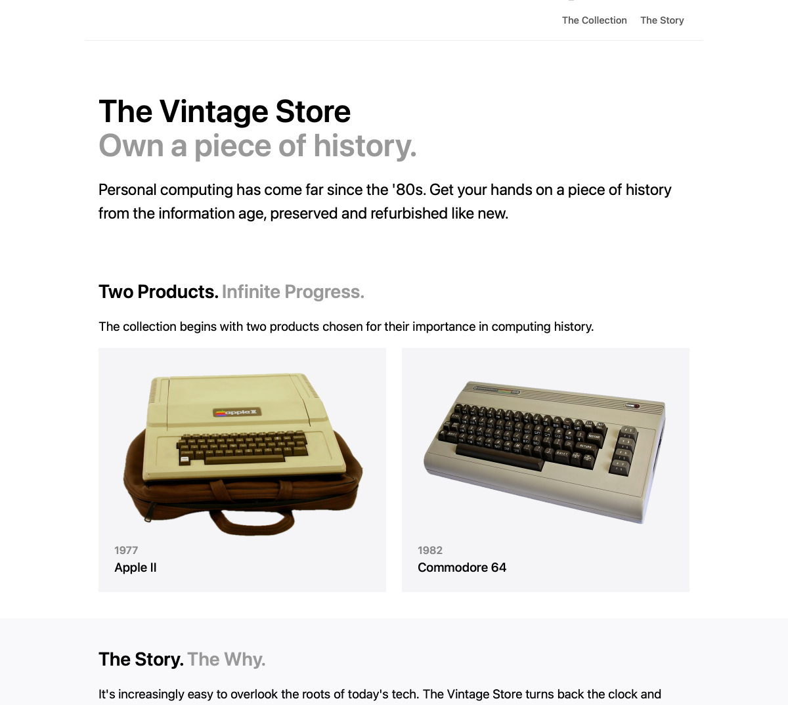
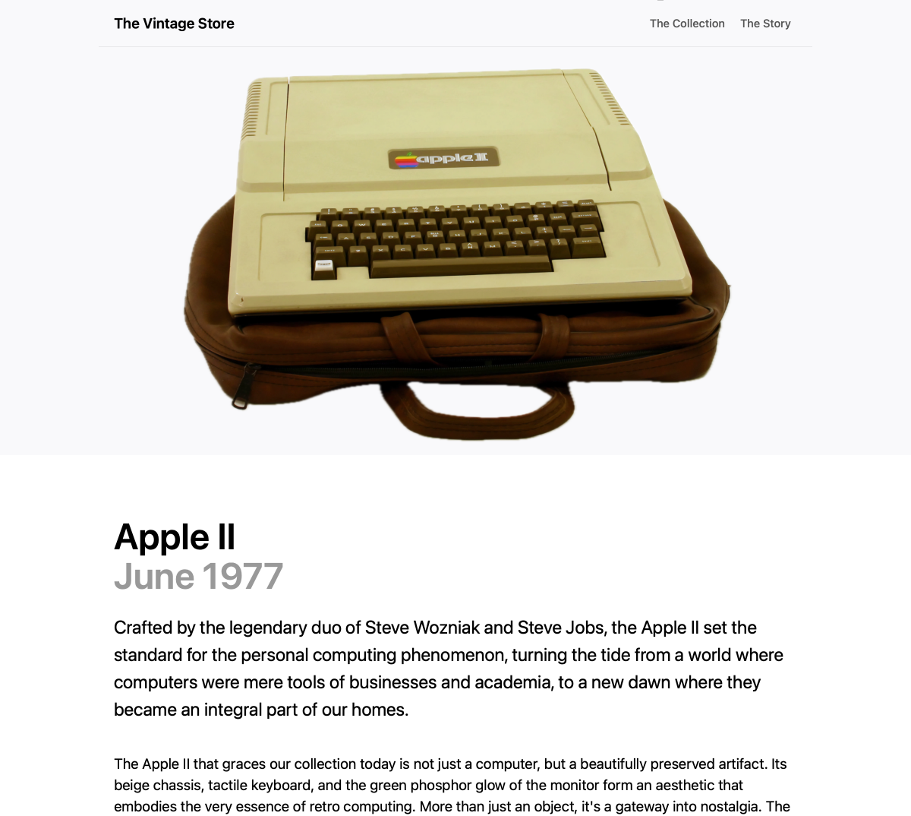

# The Vintage Store

A modern store for vintage computers. University assignment where we needed to create a website with at least three pages.

 

## Modifications from submitted assignment

Original had to be submitted as a ZIP with very specific requirements. To better suit hosting, these changes have been made:

- Project:
  - Now based on Jekyll, just to avoid duplicating the common bits in [`_layouts/default.html`](_layouts/default.html) and [`_includes/navbar.html`](_includes/navbar.html)
  - Fix mobile layout
- Filenames:
  - `home.html` → `index.html`
  - `one.html` → `products/apple-ii.html`
  - `two.html` → `products/commodore-64.html`
  - `webstyle.css` → `css/style.css`
- URLs:
  - Links to `home.html` have been replaced with `/`
  - `.html` has been removed from links